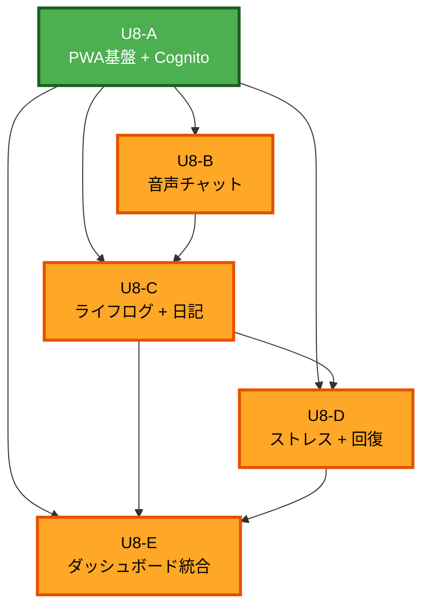

# Unit 8: Unit of Work 依存関係

## 依存マトリクス

| From ↓ / To → | U8-A | U8-B | U8-C | U8-D | U8-E |
|----------------|------|------|------|------|------|
| **U8-A** PWA基盤 | — | | | | |
| **U8-B** 音声チャット | ● | — | | | |
| **U8-C** ライフログ | ● | ● | — | | |
| **U8-D** ストレス+回復 | ● | | ● | — | |
| **U8-E** ダッシュボード | ● | | ● | ● | — |

● = 依存あり（前提として必要）

---

## 依存関係図



---

## 実装順序（クリティカルパス）

```
U8-A → U8-B → U8-C → U8-D → U8-E
 (1)    (2)    (3)    (4)    (5)
```

**シーケンシャル実行の理由:**
- U8-A: 全Unitの土台（認証・API骨格・DB接続）
- U8-B: Transcript生成がU8-Cの入力データ
- U8-C: ライフログ・ストレスデータがU8-Dの判定材料
- U8-D: 回復提案がU8-Eのダッシュボード表示データ
- U8-E: 全データを統合表示

---

## Unit間の共有リソース

| リソース | 提供元Unit | 利用Unit | 共有方法 |
|---------|-----------|---------|---------|
| DynamoDB ArsTable | 既存スタック | 全Unit | SAMパラメータ (テーブル名) |
| Cognito User Pool | U8-A | 全Unit | SAMパラメータ (Pool ID) |
| API Gateway | U8-A | U8-B〜E | 同一API Gateway にルート追加 |
| SQS Queue | U8-A (定義) | U8-B (投入), U8-C (消費) | SAMリソース |
| EventBridge Rules | U8-C | U8-C, U8-D | SAMリソース |
| BedrockClient | U8-C (初回実装) | U8-D (再利用) | 共通モジュール `shared/bedrock_client.py` |
| DataAccess | U8-A (初回実装) | 全Unit | 共通モジュール `shared/data_access.py` |

---

## デプロイ戦略

| デプロイ回 | Unit | 確認内容 |
|-----------|------|---------|
| **1回目** | U8-A | SAMデプロイ成功、CloudFront表示、デモログイン動作 |
| **2回目** | U8-A + U8-B | 音声会話成功、Transcript保存確認 |
| **3回目** | U8-A〜C | セッション終了→ライフログ抽出→日記生成→Push通知 |
| **4回目** | U8-A〜D | ストレス判定→回復提案表示 |
| **5回目** | U8-A〜E | 全画面統合、E2Eシナリオ完走 |
