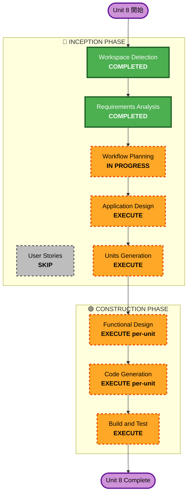

# Unit 8: Workflow Planning — 実行計画書

## 詳細分析サマリ

### 変革スコープ
- **変革タイプ**: アーキテクチャピボット（LINE Bot → PWA統合）
- **主要変更**: UI基盤・認証基盤・会話エンジン・データモデルの全面刷新
- **関連コンポーネント**: フロントエンド(PWA)、認証(Cognito)、音声(OpenAI Realtime)、分析(Bedrock)、DB(DynamoDB拡張)、Push(Web Push)

### 変更影響評価
- **ユーザー向け変更**: Yes — 完全新規UI（PWA音声チャット + ダッシュボード）
- **構造変更**: Yes — LINE Bot → PWA へのアーキテクチャ転換
- **データモデル変更**: Yes — 新規エンティティ追加 + SK命名統一
- **API変更**: Yes — Cognito JWT認証、ephemeral key発行API、Transcript保存API等
- **NFR影響**: Yes — WebRTC遅延要件、Service Worker、Web Push

### リスク評価
- **リスクレベル**: Medium
- **ロールバック複雑度**: Low（既存LINE Bot機能は変更しない。新規コードの追加のみ）
- **テスト複雑度**: Medium（外部API依存: OpenAI Realtime, Cognito）

---

## ワークフロー可視化

---

## 実行フェーズ一覧

### 🔵 INCEPTION PHASE
- [x] Workspace Detection (COMPLETED)
- [x] Requirements Analysis (COMPLETED) ✅ 2026-05-23
- [x] User Stories — **SKIP**
- [x] Workflow Planning (IN PROGRESS)
- [ ] Application Design — **EXECUTE**
  - **理由**: 新規コンポーネント多数（音声チャット、Cognito認証、ライフログ分析、ストレス判定、日記サマリ、Web Push）。コンポーネント間依存関係とメソッド定義が必要
- [ ] Units Generation — **EXECUTE**
  - **理由**: 9機能要件を実装可能な単位に分割する必要がある。依存関係の整理とデプロイ順序の決定が必要

### 🟢 CONSTRUCTION PHASE（per-unit）
- [ ] Functional Design — **EXECUTE**
  - **理由**: 各Unit のシーケンス図・エラーハンドリング・API仕様を詳細化する必要あり
- [ ] NFR Requirements — **SKIP**
  - **理由**: 要件定義書 NFR-8-01〜04 で十分カバー済み。Unit個別のNFR追加不要
- [ ] NFR Design — **SKIP**
  - **理由**: 既存Lambda+API Gatewayパターンを踏襲。WebRTC/Service Workerの詳細はFunctional Designで扱う
- [ ] Infrastructure Design — **SKIP**
  - **理由**: SAMテンプレート拡張のみ（Cognito User Pool, EventBridge Rule追加）。Functional Design内で記述可能
- [ ] Code Generation — **EXECUTE** (ALWAYS)
  - **理由**: 実装コード + テスト生成
- [ ] Build and Test — **EXECUTE** (ALWAYS)
  - **理由**: ビルド・テスト・デプロイ確認

### スキップ理由サマリ

| スキップ対象 | 理由 |
|-------------|------|
| User Stories | 要件定義書で9機能の仕様が明確。ハッカソンスピード優先 |
| NFR Requirements | 要件定義書 §4 で定義済み |
| NFR Design | Lambda+API Gateway既存パターン。特殊設計不要 |
| Infrastructure Design | SAM差分のみ。Functional Design内で記述 |

---

## 成功基準

| 項目 | 基準 |
|------|------|
| **主目標** | PWA音声チャットでふれまーるちゃんと会話できる |
| **E2Eシナリオ** | 音声会話 → ライフログ抽出 → 日記サマリ生成 → Push通知 |
| **認証** | Cognito デモログインで体験可能 |
| **ストレス→回復提案** | 会話からストレス検知 → 回復案（0円含む）表示 |
| **品質ゲート** | 各Unitのテスト通過 + デプロイ成功 |

---

## 想定Unit分割（概要、Application Design後に確定）

| Unit | 名称 | 主要機能 |
|------|------|---------|
| U8-A | PWA基盤 + Cognito認証 | PWA Shell, Service Worker, Cognito User Pool, デモログイン |
| U8-B | 音声チャット | OpenAI Realtime API (WebRTC), ephemeral key発行, Transcript保存 |
| U8-C | ライフログ + 日記サマリ | Transcript分析, ライフログ記録, 日記生成, Push通知 |
| U8-D | ストレス判定 + 回復提案 | 複合判定, 段階的誘導, 回復案表示 |
| U8-E | ダッシュボード統合 | 余剰金表示, 支出推移, 日記履歴, ナビゲーション |

> ※ 上記は暫定。Application Design / Units Generation で正式に確定する。
